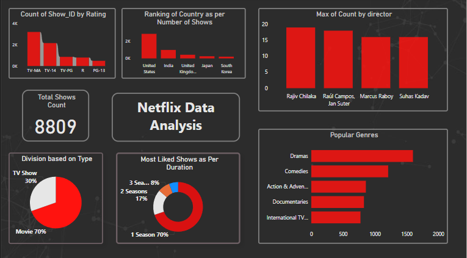

# 📺 Netflix Shows Dashboard (Power BI)

This repository contains my **third Power BI project**, where I analyzed a Netflix Shows Dataset to uncover insights about the type of content, genres, release trends, featured directors, and more.

The dataset was obtained from **Kaggle**, and I used Power BI to transform the data, create visualizations, and build an interactive dashboard. This project helped me dive deeper into **Power Query**, grouping and aggregation techniques, and effective storytelling using visual analytics.

---

## 🧠 Project Highlights

- ✅ Transformed and cleaned raw Netflix data using **Power Query Editor**
- ✅ Created queries using **Group By** operations for director, genre, type, etc.
- ✅ Built an interactive dashboard using **Bar Charts, Pie Charts, and KPI Cards**
- ✅ Analyzed **type distribution (TV Shows vs. Movies)**, **popular genres**, and **most featured directors**
- ✅ Analyzed **most available shows as per the season and duration.
- ✅ Bar Chart showing count of shows as per the rating of movies.
- ✅ Analyzing countris of production through Map.

---

## 🗂 Dataset Information

- **Source**: [Kaggle - Netflix Shows Dataset](https://www.kaggle.com/datasets/shivamb/netflix-shows)
- **Format**: CSV
- **Attributes**:
  - `show_id`: Unique identifier for each title
  - `type`: Indicates whether the title is a **Movie** or a **TV Show**
  - `title`: Name of the show/movie
  - `director`: Director(s) involved
  - `cast`: Main actors/actresses
  - `country`: Country of production
  - `date_added`: When it was added to Netflix
  - `release_year`: Year of original release
  - `rating`: Age-based content rating (TV-MA, PG, etc.)
  - `duration`: Runtime or number of seasons
  - `listed_in`: Genre(s) or categories
  - `description`: Brief synopsis of the content

---

## 📊 Dashboard Features

### 📌 Visuals Included:
- 📌 **KPI Cards** showing:
  - Total number of titles
  - Percentage of TV Shows vs Movies
- 📌 **Bar Chart** showing most loved genres
- 📌 **Pie Chart** showing content type distribution
- 📌 **Bar Chart** of most featured directors
- 📌 **Map** for countries of production
---

## 🧰 Tools & Techniques Used

- **Power BI Desktop**
- **Power Query Editor**
- **DAX (Data Analysis Expressions)**
- **Bar and Pie Charts for comparison**
- **KPI Cards for summary statistics**
- **Maps** for showing countries of production

---

## 📸 Dashboard Preview

---

## 🚀 How to Run This Report

1. Clone or download this repository
2. Open `NetflixDashboard.pbix` in [Power BI Desktop](https://powerbi.microsoft.com/desktop/)
3. Use the visuals to interact with insights.

---

## 🙋‍♀️ About Me

Hi! I'm **Varsha**, a computer science student and aspiring data analyst. This is my **third Power BI project**, and I’m building my portfolio one dataset at a time — practicing consistency and real-world data storytelling. 🧠✨

- 💼 GitHub:(https://github.com/VarshaPandey24)
- 🔗 LinkedIn:(https://linkedin.com/in/varshapandey6)

---

## 🙏 Acknowledgements

- Dataset by **Shivam Bansal** on [Kaggle](https://www.kaggle.com/datasets/shivamb/netflix-shows)
- Power BI community resources and tutorials for guidance on dashboard design

